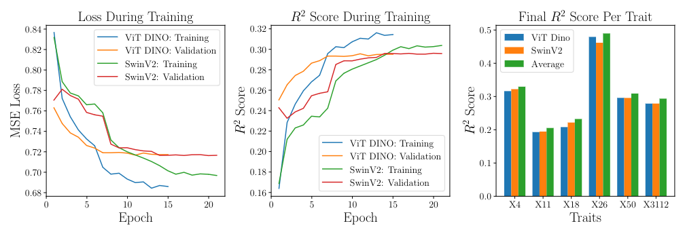

# Plant Trait Prediction

Final Project for CS 480, Introduction to Machine Learning. The final project was a Kaggle Competition to predict plant traits from plant images and corresponding environmental variables. The project was inspired by [this paper](https://doi.org/10.1038/s41598-021-95616-0).

I train a fully connected network on the environmental variables to extract features, and apply pretrained transformers ([Swin](https://arxiv.org/abs/2103.14030) or (ViT)[https://arxiv.org/abs/2010.11929]) to extract features from the images. Then, I use a fully connected network to predict the plant traits. I average the predictions from the different networks for the different pretrained models.

## To Run

Run
```
scripts/script.sh
```
from the folder `code` with data in the folder `data`.

## Some Results


